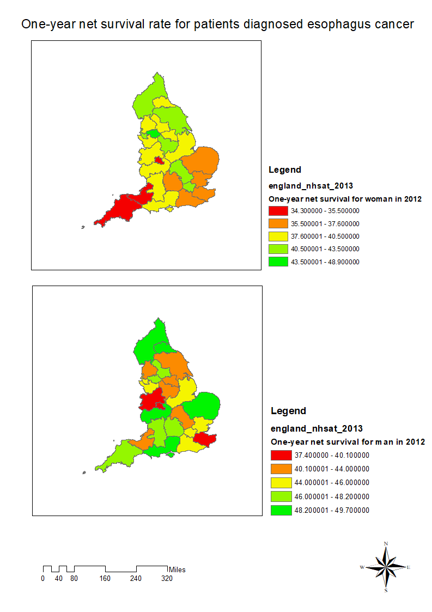

```{r setup}
library(tidyverse)
library(maptools)
library(RColorBrewer)
library(classInt)
library(OpenStreetMap)
library(sp)
library(rgeos)
library(tmap)
library(tmaptools)
library(sf)
library(rgdal)
library(geojsonio)
```

## R Markdown

This is an R Markdown document. Markdown is a simple formatting syntax for authoring HTML, PDF, and MS Word documents. For more details on using R Markdown see <http://rmarkdown.rstudio.com>.

When you click the **Knit** button a document will be generated that includes both content as well as the output of any embedded R code chunks within the document. You can embed an R code chunk like this:

```{r code}
NHSData<- read_csv("NHSDATA.csv")
NHSData <- data.frame(NHSData)
NHSMapSF <- read_shape("England_nhsat_2013/england_nhsat_2013.shp", as.sf = TRUE)
NHSMapSP <- as(NHSMapSF, "Spatial")
NHSDataMap <- append_data(NHSMapSF,NHSData, key.shp = "code", key.data = "New.code", ignore.duplicates = TRUE)
tmap_mode("view")
qtm(NHSDataMap)+
  tm_shape(NHSDataMap) + 
  tm_polygons("One.year.net.survival.for.woman.in.1997", 
              style="jenks",
              palette="YlOrBr",
              midpoint=NA,
              title="Rate for survival",
              alpha = 0.5) + 
  tm_scale_bar(position = c("left", "bottom")) +
  tm_layout(title = "One year net survival for woman diagnosed esophagus cancer in 1997")

```

## Maps

Map produced by GUI-based software(ArcGIS)

Map produced by code-based software(R)

##Comment

There are two maps produced by GIS software to represent the one-year net survival rate for patients diagnosed oesophagus cancer in England, the boundary data has been collected from  www.ukdataservice.ac.uk, the statistical data has been collected from www.digital.nhs.uk. 

Data sources should be the first thing users need to consider if they decide to generate a map. Generally speaking, most of formats could be well-supported by both of GUI-based and code-based GIS software. Users for code-based GIS may need to install and import some packages developed by third-party to read and edit data file (i.e. maptools and rgdal in R). One of the problems is the compatibility issue caused by version differences, some error may happen due to the different platform version and dependent packages. GUI-based software can avoid the majority of compatibility issues because most of functions and tools have been integrated in one well-tested software. One thing should be noticed that the statistical data should be cleaned before importing into ArcGIS software, but R provide strong tools allow users clean data after reading the data. Both of two software allow users import and temporarily store the data in the software and export the edited data to multi-formats file. 

One obvious difference between two software is the UI (User Interface), GUI-based GIS software like other daily-used software, users can easily find the tools they need by clicking the toolbar or search it in the search box. Comparing with the GUI-based, the learning cost of code-based software is relatively high, especially for the users without any programming experience. However, traceability would be the most crucial benefit bring by the command line UI. Users could follow the codes and commands to trace every step, it can contribute to explain the work and map to colleague or other experts. Furthermore, traceability would be very helpful especially in some cases the produced map is not as good as the user expect, the high traceability also provides the maintainability. 

Comparing with the GUI based software, another important benefits for code-based software is repeatability. Once a user finished the producing first map, the user or other users are able to produce similar maps via copying and modifying the code written for the first map. It means the high-efficiency when users need to produce a series of maps using different data but showing in the same style. On the other hand, it would be tedious processing if choosing GUI based software: users have to repeat most of operations they produced the first map.

The representing quality also be affected by the layout and design of the map. GUI-Based software allows users to preview the map before generating. User can move the elements in the map by dragging mouse, and the change could be displayed in the real-time preview window. However, it would be quite difficult for users to do some fine-tuning by using code-based software since user cannot have the real-time feedback while changing the code. Therefore, the GUI-based software performed better for the mapping tasks which need delicate design. 
